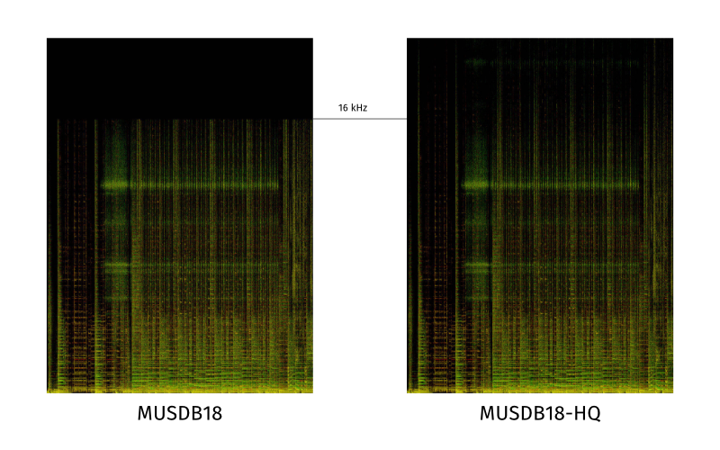

# MUSDB18


The _musdb18_ is a dataset of 150 full lengths music tracks (~10h duration) of different styles along with their isolated _drums_, _bass_, _vocals_ and _others_ stems.

_musdb18_ contains two folders, a folder with a training set: "train", composed of 100 songs, and a folder with a test set: "test", composed of 50 songs. Supervised approaches should be trained on the training set and tested on both sets.

All signals are stereophonic and encoded at 44.1kHz.

The data from _musdb18_ is composed of several different sources:
* 100 tracks are taken from the [DSD100 dataset](dsd100.md), which is itself derived from [The 'Mixing Secrets' Free Multitrack Download Library](www.cambridge-mt.com/ms-mtk.htm). Please refer to this original resource for any question regarding your rights on your use of the DSD100 data.
* 46 tracks are taken from [the MedleyDB](http://medleydb.weebly.com) licensed under Creative Commons (BY-NC-SA 4.0).
* 2 tracks were kindly provided by Native Instruments originally part of [their stems pack](https://www.native-instruments.com/en/specials/stems-for-all/free-stems-tracks/).
* 2 tracks are from the Canadian rock band The Easton Ellises as part of the [heise stems remix competition](https://www.heise.de/ct/artikel/c-t-Remix-Wettbewerb-The-Easton-Ellises-2542427.html#englisch), licensed under Creative Commons (BY-NC-SA 3.0).

Have a look at the [detailed list of all tracks](https://github.com/sigsep/website/blob/master/content/datasets/assets/tracklist.csv).

## Compressed STEMS


All files from the _musdb18_ dataset are encoded in the [Native Instruments stems format](http://www.stems-music.com/) (.mp4). It is a multitrack format composed of 5 stereo streams, each one encoded in AAC @256kbps. These signals correspond to:

- `0` - The mixture,
- `1` - The drums,
- `2` - The bass,
- `3` - The rest of the accompaniment,
- `4` - The vocals.

For each file, the mixture correspond to the sum of all the signals.

::: warning Note
Since the mixture is separately encoded as AAC, there there is a small difference between the __sum of all sources__ and the __mixture__. The result of the compression is a bandwidth, limited to 16 kHz. This difference has _no impact_ on the bsseval evaluation performance.
:::

## Uncompressed WAV



As an alternative, we also offer the uncompressed WAV files for models that aim to predict high bandwidth of up to 22 kHz. Note that if you want to compare to SiSEC 2018 participants, you should use the standard MUSDB18 dataset, instead.

### Download

::: warning Note
 The dataset is hosted on Zenodo and requires that users request access, since the tracks can only be used for academic purposes. We __manually__ check this requests. Please _do not_ fill the form multiple times, it usually takes as less than a day to give you access.
:::

* [Download MUSDB18 (4.4 Gb)](https://zenodo.org/record/1117372) [](https://doi.org/10.5281/zenodo.1117372)

* [Download MUSDB18-HQ (22.7 Gb)](https://zenodo.org/record/3338373) 
[](https://doi.org/10.5281/zenodo.3338373)

* [Sample Data (11 MB)](https://www.dropbox.com/s/aihhp0fkboefxy3/mus-sample.zip?dl=1)

When the download is done, you can use the following tools to use the stems-encoded musdb in your scripts:

## Tools

### Parsers

* [musdb](https://github.com/sigsep/sigsep-mus-db): Python based dataset parser
* [mus-io](https://github.com/sigsep/sigsep-mus-io): Docker scripts for decoding/encoding STEMS <=> wav (i.e. MATLAB users go there)
* [musdb.jl](https://github.com/davidavdav/Musdb.jl): Julia based dataset parser

### Evaluation

* [museval](https://github.com/sigsep/sigsep-mus-eval): BSSEval v4 Evaluation tools

### Further Tools

* [cutlist-generator](https://github.com/sigsep/sigsep-mus-cutlist-generator): Scripts to generate 30s and 7s excerpt annotations from the full dataset based on the activity of all sources.
* [preview-generator](https://github.com/sigsep/sigsep-mus-preview-generator): Scripts to cut and recode the dataset based on provided cutlists.

### Oracle Methods

* [oracle](https://github.com/sigsep/sigsep-mus-oracle): Python based oracle method implementation like Ideal Binary Mask, Softmasks, Multichannel Wienerfilter

## SiSEC 2018 Evaluation Campaign

* [SiSEC 2018](https://github.com/sigsep/sigsep-mus-2018): Raw scores
* [SiSEC 2018 - Analysis](https://github.com/sigsep/sigsep-mus-2018-analysis): Analysis of 2018 Submissions
* [Paper](https://arxiv.org/abs/1804.06267)<Badge text="preprint" type="warn"/>:  all results, to be published at International Conference on Latent Variable Analysis and Signal Separation.

### Acknowledgements

We would like to thank Mike Senior, Rachel Bittner, and also Mickael Le Goff, not only for giving us the permission to use this multitrack material, but also for maintaining such resources for the audio community.

#### Authors

- Zafar Rafii
- Antoine Liutkus
- Fabian-Robert Stöter
- Stylianos Ioannis Mimilakis
- Rachel Bittner

### Citation

If you use MUSDB18, please reference it accordingly:

```
@misc{musdb18,
  author       = {Rafii, Zafar and
                  Liutkus, Antoine and
                  Fabian-Robert St{\"o}ter and
                  Mimilakis, Stylianos Ioannis and
                  Bittner, Rachel},
  title        = {The {MUSDB18} corpus for music separation},
  month        = dec,
  year         = 2017,
  doi          = {10.5281/zenodo.1117372},
  url          = {https://doi.org/10.5281/zenodo.1117372}
}
```

if you use MUSDB18-HQ, please cite

```tex
@misc{musdb18-hq,
  author       = {Rafii, Zafar and
                  Liutkus, Antoine and
                  Stöter, Fabian-Robert and
                  Mimilakis, Stylianos Ioannis and
                  Bittner, Rachel},
  title        = {MUSDB18-HQ - an uncompressed version of MUSDB18},
  month        = aug,
  year         = 2019,
  doi          = {10.5281/zenodo.3338373},
  url          = {https://doi.org/10.5281/zenodo.3338373}
}
```
